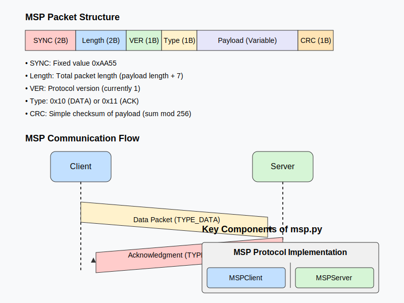
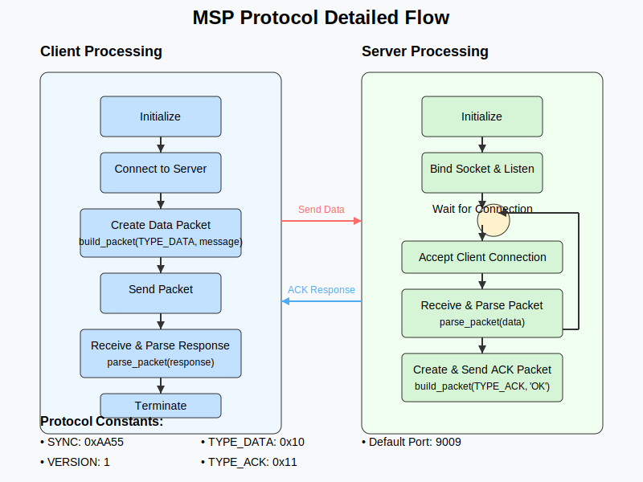

# Minokamo Secure Protocol (MSP)

Minokamo Secure Protocol (MSP) is a minimal, educational TCP-based protocol with CRC validation and structured binary packet format.

## Features

- ✅ Custom binary packet structure:
  - SYNC (2 bytes)
  - LENGTH (2 bytes)
  - VERSION (1 byte)
  - TYPE (1 byte)
  - PAYLOAD (n bytes)
  - CRC (1 byte)
- ✅ Works over TCP sockets
- ✅ Ctrl+C (safe shutdown with timeout)
- ✅ Easy to understand and extend
- ✅ Ideal for educational use or protocol experimentation

## Requirements

- Python 3.8+
- No external libraries needed

## Usage

### Start server:

```bash
python msp.py --mode server --host 127.0.0.1 --port 9009 
```
### Send message (client):

```bash
python msp.py --mode client --host 127.0.0.1 --port 9009 --message "Hello MSP"
```
## Planned Features  
- 🔐 AES encryption support (future update)  
- 🖥️ GUI tool (Tkinter)  
- 📡 COM port & physical serial support  
- 📁 File transfer protocol

## Protocol Diagram



## Protocol Detailed Flow 



## 📄 LICENSE (LICENSE file content - MIT)

MIT License

Copyright (c) 2025 Mamu Minokamo

Permission is hereby granted, free of charge, to any person obtaining a copy
of this software and associated documentation files (the "Software"), to deal
in the Software without restriction, including without limitation the rights
to use, copy, modify, merge, publish, distribute, sublicense, and/or sell
copies of the Software, and to permit persons to whom the Software is
furnished to do so, subject to the following conditions:

The above copyright notice and this permission notice shall be included in all
copies or substantial portions of the Software.

THE SOFTWARE IS PROVIDED "AS IS", WITHOUT WARRANTY OF ANY KIND, EXPRESS OR
IMPLIED, INCLUDING BUT NOT LIMITED TO THE WARRANTIES OF MERCHANTABILITY,
FITNESS FOR A PARTICULAR PURPOSE AND NONINFRINGEMENT. IN NO EVENT SHALL THE
AUTHORS OR COPYRIGHT HOLDERS BE LIABLE FOR ANY CLAIM, DAMAGES OR OTHER
LIABILITY, WHETHER IN AN ACTION OF CONTRACT, TORT OR OTHERWISE, ARISING FROM,
OUT OF OR IN CONNECTION WITH THE SOFTWARE OR THE USE OR OTHER DEALINGS IN THE
SOFTWARE.